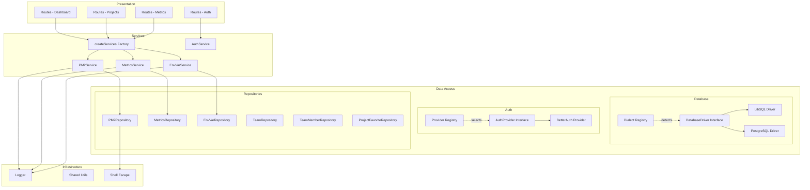

# Architecture

## Overview

PM2 View uses a layered architecture with dependency injection and registry patterns for extensibility.

## Layers

## Key Patterns

### Registry Pattern (Open/Closed)
Drivers and providers are selected via registry maps — adding new options requires zero changes to existing code.

### Dependency Injection
Services are created via a centralized factory (`createServices()`) — route files never instantiate dependencies directly.

### Repository Pattern
Data access is abstracted behind interfaces — the domain layer doesn't know about Drizzle, SQLite, or PostgreSQL.
