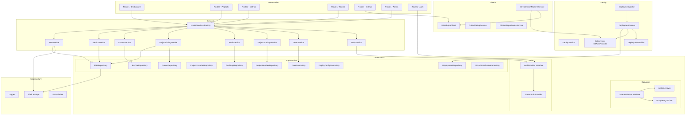

# Architecture

## Overview

PM2 View uses a layered architecture with dependency injection and registry patterns for extensibility.

## Layers

```mermaid
graph TB
    subgraph Presentation
        R1[Routes - Dashboard]
        R2[Routes - Projects]
        R3[Routes - Metrics]
        R4[Routes - Teams]
        R5[Routes - GitHub]
        R6[Routes - Admin]
        R7[Routes - Auth]
    end

    subgraph Services
        SC[createServices Factory]
        PS[PM2Service]
        MS[MetricsService]
        ES[EnvVarService]
        PL[ProjectListingService]
        AU[AuditService]
        SH[ProjectSharingService]
        TS[TeamService]
        US[UserService]
    end

    subgraph Data Access
        subgraph Database
            DI[DatabaseDriver Interface]
            LD[LibSQL Driver]
            PGD[PostgreSQL Driver]
        end

        subgraph Auth
            API[AuthProvider Interface]
            BAP[BetterAuth Provider]
        end

        subgraph Repositories
            PM2R[PM2Repository]
            PR[ProjectRepository]
            PMR[ProjectMemberRepository]
            PFR[ProjectFavoriteRepository]
            TMR[TeamRepository]
            ER[EnvVarRepository]
            ALR[AuditLogRepository]
            DCR[DeployConfigRepository]
            DR[DeploymentRepository]
            GIR[GitHubInstallationRepository]
        end
    end

    subgraph Deploy
        DSR[DeployService]
        DRUN[DeploymentRunner]
        DW[DeploymentWorker]
        GIT[GitService / GitAuthProvider]
        DNOT[DeploymentNotifier]
    end

    subgraph GitHub
        GAC[GitHubAppClient]
        GS[GitHubSetupService]
        GR[GitHubRepositoriesService]
        GIP[GitHubImportPipelineService]
    end

    subgraph Infrastructure
        L[Logger]
        S[Shell Escape]
        RL[Rate Limiter]
    end

    R1 --> SC
    R2 --> SC
    R3 --> SC
    R4 --> SC
    R5 --> GAC
    R6 --> SC
    R7 --> API

    SC --> PS
    SC --> MS
    SC --> ES
    SC --> PL
    SC --> AU
    SC --> SH
    SC --> TS
    SC --> US

    PS --> PM2R
    MS --> PM2R
    ES --> ER
    PL --> PM2R
    PL --> PR
    AU --> ALR
    SH --> PMR
    TS --> TMR
    US --> API

    DRUN --> DR
    DRUN --> GIT
    DRUN --> DNOT
    DW --> DRUN
    GIP --> GIT
    GIP --> GAC

    DI --> LD
    DI --> PGD

    API --> BAP

    PS --> S
    PM2R --> S
```

## Key Patterns

### Registry Pattern (Open/Closed)
Drivers and providers are selected via registry maps — adding new options requires zero changes to existing code.

### Dependency Injection
Services are created via a centralized factory (`createServices()`) — route files never instantiate dependencies directly.

### Repository Pattern
Data access is abstracted behind interfaces — the domain layer doesn't know about Drizzle, SQLite, or PostgreSQL.

## Domains

| Domain | Location | Notes |
| ------ | -------- | ----- |
| Auth | `src/lib/auth/` | Pluggable provider (Better Auth default) |
| Database | `src/lib/db/` | Dialect-agnostic drivers + Drizzle schema/repositories |
| PM2 | `src/lib/pm2/` | `pm2 jlist`-based process management, log reading, restart fallback |
| Metrics | `src/lib/metrics/` | **Live-only** aggregation (no DB persistence) + optional recorder snapshots |
| Env vars | `src/lib/env-vars/` | Environment variable management |
| Deploy | `src/lib/deploy/` | Webhook-driven deployment pipeline (runner + worker) |
| Deploy config | `src/lib/deploy-config/` | Per-project install/build/restart commands |
| GitHub | `src/lib/github/` | App install, repo listing, import pipeline |
| Ports | `src/lib/ports/` | Port scanning (`ss`/`lsof`), OTP-verified kill (see [docs/port-manager.md](port-manager.md)) |
| Services | `src/lib/services/` | `ProjectListingService` (grouping) + admin services (audit/sharing/team/user) |
| SSE | `src/lib/sse/` | Real-time metrics/status emission |
| Notifications | `src/lib/notifications/` | Pluggable notification channel (nodemailer) |
