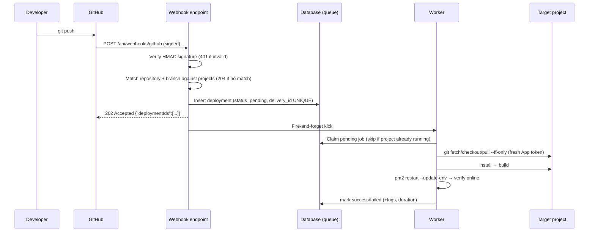

# Auto-Deploy via GitHub Webhooks — Setup & Operations Guide

This guide explains the automatic deployment feature: when GitHub sends a `push` event for a configured repository and branch, PM2 View runs a full deployment pipeline (git → install → build → pm2 restart → health verification) in the background and records every step.

> **TL;DR** — You need `GITHUB_WEBHOOK_SECRET` set, the GitHub App installed for the repository owner, the project configured in its **Config** tab, and a webhook registered in GitHub. The flow is: push → GitHub POSTs → PM2 View verifies signature and matches repo/branch → queues a deployment → worker executes the pipeline → history visible in the UI.

## What this feature does

| Capability | How it works |
| ---------- | ------------ |
| **Trigger** | GitHub `push` webhook events only |
| **Security** | HMAC-SHA256 signature verification over the raw body (timing-safe) |
| **Idempotency** | `X-GitHub-Delivery` header stored with a UNIQUE constraint; replays are acknowledged, never executed twice |
| **Execution** | Background worker; HTTP responds `202 Accepted` immediately |
| **Observability** | Per-stage logs persisted in the database; history card polls every 5s |

## Flow diagram



## Deployment stages and failure semantics

| Stage | Actions | On failure |
| ----- | ------- | ---------- |
| **git** | Dirty-tree check (tracked files only) → fetch → checkout branch → `pull --ff-only` | Deployment fails fast; nothing touched |
| **install** | Configured command, or package-manager install fallback (`pnpm`/`npm`/`yarn`) | Fails; build never runs |
| **build** | Configured command, or `<pm> run build` if script exists; skipped if neither | Fails; **PM2 is NOT restarted** |
| **pm2** | `pm2 restart <name> --update-env`, then poll until process is online | Fails if restart errors or process never reaches online |

Non-destructive policy: the pipeline never runs `reset --hard`, `clean`, or `checkout .`. Untracked files are ignored by the dirty check (they can't be destroyed by fetch/pull); local modifications to tracked files abort the deployment explicitly.

## Setup, step by step

### Prerequisites

- The [GitHub App integration](./github-integration.md) is installed for the account/org that owns the target repository (the runner mints fresh installation tokens per deploy).
- The project row has `target_path` (absolute path to a local clone) and `pm2_name` (an existing PM2 process).

### 1. Environment variables

```bash
# Required: secret shared with GitHub's webhook configuration
GITHUB_WEBHOOK_SECRET=<openssl rand -hex 32>

# Optional: public base URL shown in the UI for the webhook payload URL.
# Falls back to the browser origin when unset.
PUBLIC_WEBHOOK_BASE_URL=https://pm2-view.example.com
```

### 2. Apply the migration

```bash
npm run db:migrate
```

Migration `0007_add_auto_deploy.sql` adds `github_repo`, `deploy_branch`, `auto_deploy_enabled` to `projects` and creates the `deployments` table (which doubles as the job queue).

### 3. Configure the project in the UI

Project → **Config** tab → **Automatic Deployment** card:

| Field | Example | Notes |
| ----- | ------- | ----- |
| Enable automatic deployment | ON | Master switch; ignored pushes return 204 |
| GitHub Repository | `octocat/hello-world` | Copy from the repo URL `github.com/<owner>/<name>`; must match exactly |
| Branch | `main` | Only pushes to this ref deploy |

Click **Save**. This writes `github_repo`, `deploy_branch` and `auto_deploy_enabled`.

### 4. Register the webhook in GitHub

Repository → Settings → Webhooks → Add webhook:

| Setting | Value |
| ------- | ----- |
| Payload URL | `{PUBLIC_WEBHOOK_BASE_URL}/api/webhooks/github` (public HTTPS URL) |
| Content type | `application/json` |
| Secret | Same value as `GITHUB_WEBHOOK_SECRET` |
| Events | *Push* only |

### 5. Verify

- [ ] Card saved without validation errors
- [ ] `curl` to the webhook URL returns 401 without a valid signature
- [ ] A test push (or signed simulation below) produces a `success` entry in the deployment history
- [ ] PM2 process shows a new PID / reset uptime

## Testing locally (no GitHub required)

Simulate a signed push event:

```bash
node -e "
require('dotenv').config();
const crypto = require('crypto');
const body = JSON.stringify({ref:'refs/heads/main',after:'b'.repeat(40),repository:{full_name:'owner/project'}});
const sig = 'sha256=' + crypto.createHmac('sha256', process.env.GITHUB_WEBHOOK_SECRET).update(body).digest('hex');
require('http').request({host:'localhost',port:5179,path:'/api/webhooks/github',method:'POST',headers:{'content-type':'application/json','x-github-event':'push','x-github-delivery':String(Date.now()),'x-hub-signature-256':sig}}, r=>{let d='';r.on('data',c=>d+=c);r.on('end',()=>console.log(r.statusCode,d))}).end(body);
"
```

Expected responses:

| Code | Meaning |
| ---- | ------- |
| `202` | Accepted; deployment queued (body includes ids) |
| `200` | Duplicate delivery (idempotent replay) |
| `204` | Ignored: non-push event, or repo/branch mismatch, or auto-deploy disabled |
| `401` | Invalid signature |

## Security model

| Control | Mechanism |
| ------- | --------- |
| Request authenticity | HMAC-SHA256 over raw body, timing-safe comparison |
| Credential exposure | Tokens minted per deploy, injected as `http.extraheader`, redacted in persisted logs |
| Payload trust | Webhook data is limited to matching (repo, branch) and a validated commit SHA; paths and commands always come from internal project configuration |
| Secrets in UI | Never rendered; webhook secret lives only in server env |

## Where the code lives

| Path | Role |
| ---- | ---- |
| `src/lib/deploy/process-runner.ts` | Shared spawn-based command execution (args array, timeouts) |
| `src/lib/deploy/git.service.ts` | Safe git operations + token auth args (redacted logging) |
| `src/lib/deploy/git-auth.provider.ts` | Mints short-lived GitHub App installation tokens per repository |
| `src/lib/deploy/deployment-runner.ts` | Staged pipeline executor with injectable dependencies |
| `src/lib/deploy/deployment-worker.ts` | Sequential queue consumer; stale-run recovery |
| `src/lib/deploy/factory.ts` | Production dependency wiring (singleton) |
| `src/routes/api/webhooks/github/+server.ts` | Push event ingestion |
| `src/lib/db/schema/deployments.ts` | Queue/history persistence |

## Troubleshooting

| Symptom | Likely cause | Fix |
| ------- | ------------ | --- |
| `401 Invalid webhook signature` | Secret mismatch between GitHub and env | Compare `GITHUB_WEBHOOK_SECRET` values |
| Push ignored (`204`) | Repo/branch mismatch or toggle off | Check card values match GitHub exactly |
| Failed at git: authentication | No GitHub App installation for the repo owner | Install the app / verify `github_installations` row |
| Failed at git: local modifications | Tracked files changed in the clone | Resolve/stash changes in `target_path` |
| Failed at pm2: process not found | Process name wrong or never started | Start it once manually; auto-start is not supported yet |
| Build failed, process still old PID | By design: PM2 restarts only after a successful build | Fix build; redeploy |

## Future improvements

- Swap the DB-backed queue for BullMQ behind the same repository interface
- Coalesce bursts: latest-commit-wins instead of one run per push
- Global deployments dashboard across all projects
- Repository picker fed by the installed App (instead of typing owner/name)
- Auto-start missing PM2 processes from an ecosystem file
