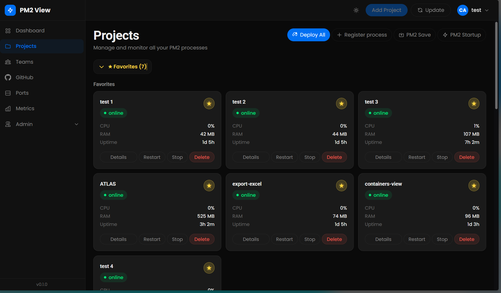
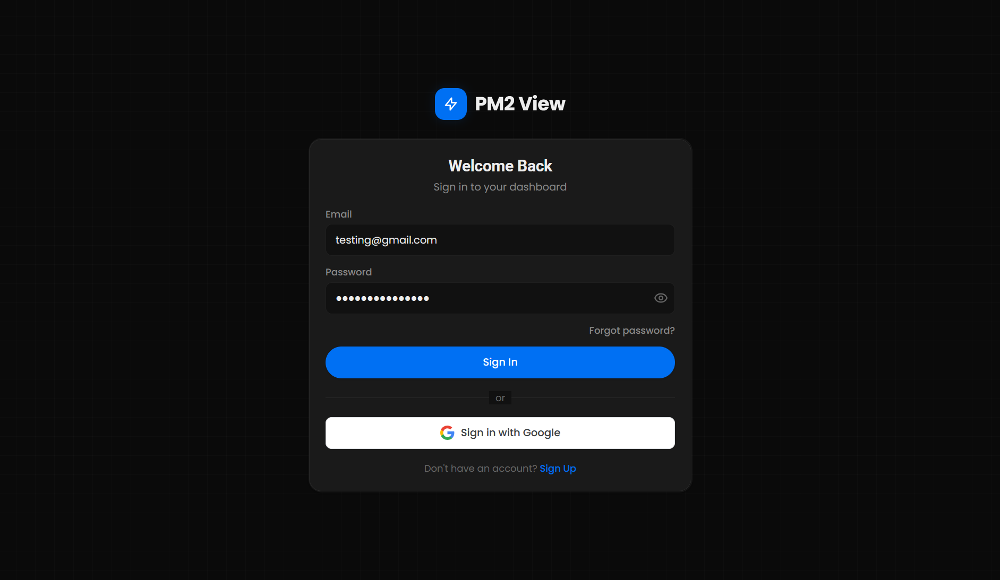
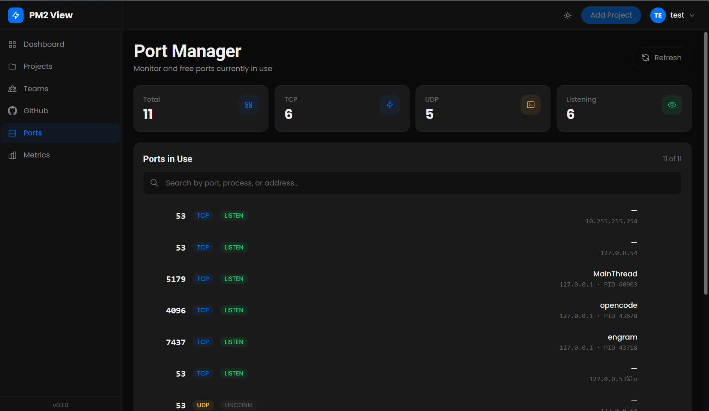
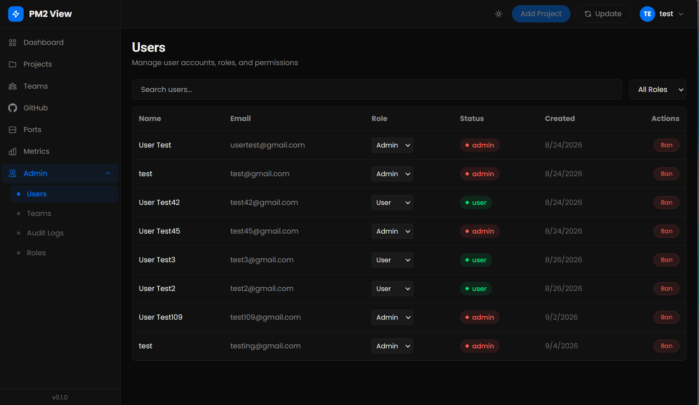
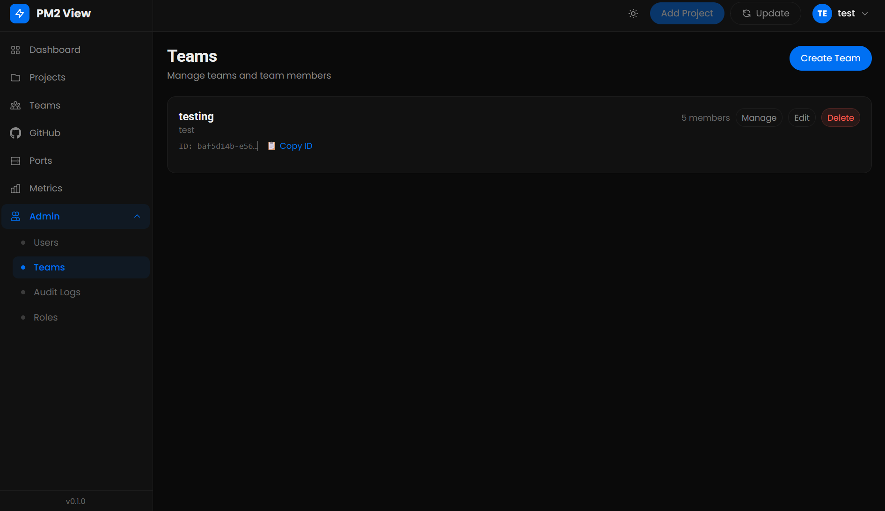
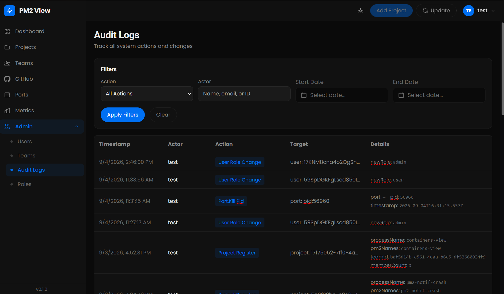

# Modules Guide & Visual Tour

A visual overview and module-by-module guide for PM2 View.

---

## 0. Projects Dashboard

The central operational dashboard provides real-time visibility and process control over all PM2 services.

- **Process Monitoring**: Live status (`online`, `stopped`, `errored`), CPU percentage, RAM consumption, and uptime.
- **Process Actions**: Instant restart, stop, delete, and recreate operations with automatic fallback recovery.
- **Organization**: Collapsible **Favorites** pinning and grouping of multi-process monorepos/workspaces.
- **Operations Toolbar**: One-click **Deploy All**, **Register Process**, **PM2 Save** (persist configuration), and **PM2 Startup** systemd setup.

---

## 1. Authentication & Access Control

PM2 View secures access with an authentication system powered by [Better Auth](https://www.better-auth.com/).

- **Route**: `/login`, `/register`, `/forgot-password`, `/reset-password`
- **Sign-in Methods**: Email & password authentication as well as Google OAuth 2.0.
- **Password Recovery**: Self-service password reset flow with email notification or local console fallback.
- **Security**: HTTP-only session cookies, CSRF protection, and route-level authentication guards.

---

## 2. Port Manager

A dedicated system-level networking inspector and process manager built for administrators.

- **Route**: `/ports` *(Admin only)*
- **Documentation**: [Port Manager Deep Dive](port-manager.md)
- **Features**:
  - **Socket Inspection**: Scans active TCP and UDP sockets using `ss` (with `lsof` fallback).
  - **Deduplication**: Intelligent socket deduplication across IPv4 and IPv6 interfaces.
  - **Live Filter**: Fast search by port number, process name, PID, or bound address.
  - **OTP-Verified Kill**: Destructive port freeing (`kill -9` by PID or `fuser -k` by port) requires a time-limited 6-digit OTP delivered via email.
  - **Audit Trail**: Every port termination is logged with actor, target, and timestamp in the audit log.

---

## 3. User Management

Administrative interface for managing platform users and role-based permissions.

- **Route**: `/admin/users` *(Admin only)*
- **Features**:
  - **User Directory**: Searchable directory displaying user name, email, creation date, and status.
  - **Role Assignment**: Dynamic role switching between `admin` and `user`.
  - **Access Control**: Instant account suspension and ban management.
  - **Audit Logging**: All permission changes and ban actions are recorded in the audit log.

---

## 4. Team Management & Workspaces

Collaborative team spaces for organizing projects and managing shared access across engineering groups.

- **Route**: `/admin/teams` and `/teams`
- **Documentation**: [Sharing & Permissions](sharing-permissions.md)
- **Features**:
  - **Workspaces**: Create, manage, and configure team workspaces.
  - **Granular Roles**: Team roles including `team_owner`, `team_admin`, and `team_member`.
  - **Project Sharing**: Share PM2 projects with whole teams or individual users with viewer or editor roles.
  - **Unique Identifiers**: Copyable team IDs for quick reference and assignment.

---

## 5. Audit Logs

An append-only, searchable compliance and activity trail tracking sensitive administrative actions.

- **Route**: `/admin/audit` *(Admin only)*
- **Documentation**: [Audit Module Architecture](audit-module.md)
- **Features**:
  - **Event Tracking**: Captures user role changes, process registrations, deployments, and port kills.
  - **Detailed Metadata**: Tracks actor, timestamp, action type, target resource, and change details.
  - **Advanced Filters**: Multi-criteria filtering by action type, actor (name/email/ID), and start/end dates.
  - **Exporting**: One-click CSV export of filtered audit logs for compliance reviews.

---

## Related Documentation

- [Architecture & Layers](architecture.md)
- [Multi-Process Groups](multi-process-groups.md)
- [GitHub Integration & Auto-Deploy](auto-deploy.md)
- [Process Error Alerts](process-error-alerts.md)
